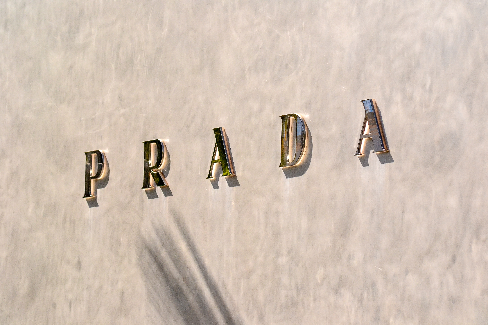
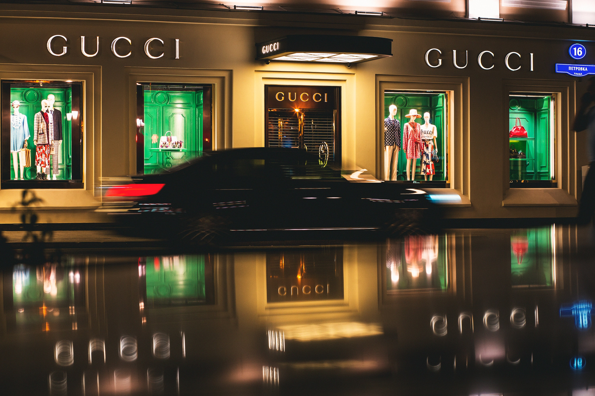

The Human brain takes fractions of seconds to analyse, critique and understand images just by taking a quick glance. Therefore, it is so important to Brands to fit all their best qualities into one Logo, a Logo that will identify them, classify them as an expensive or cheap brand just because the fonts are different. Companies invest millions into the design of their logo and today we will be having a look at a few that pay the most to see if there is a difference between those who pay the least.

The likes of Prada, Louis Vuitton, Brioni and many alike tend to opt for their name to be small but in a large space. Just by glancing at this our mind tells us that this is an expensive brand but, why?

Psychologically we consider small things taking up big spaces to be a waste of money. We do this on the basis that in our society, in our world, anything that is bigger is more expensive therefore, a large surface area will cost a fortune and to keep something small in the middle of it is a waste of money. Just because of these small factors our brain has already decided that the brand is expensive even before knowing the price of any of the items in there.

Luxurious brands also tend to use more pastel and calming colours to maximise the sense of luxury, calmness and welcoming for their brand. Some such as Gucci, however, use bright colours, this in no shape or form scares the customers and Gucci themselves tend to produce quite exciting and colourful clothing. The colours around the typography are important but not anywhere near as important as the letters themselves. Numerous Luxury brands opt for similar fonts. They all have a certain length and shape of serif that attracts the eye. Fonts such as Finnmark, Belgiana script and other all have a similar pattern they are just ever so slightly different. These fonts allow us to understand the brand.

Come back next week when we look more closely at the factors that benefit the less luxurious brands and what they do to stand out in such a busy market. 

From the information gathered, many luxurious clothing brands logos are similar and the use of space, use of colours and especially the use of typography, the fonts, all make a drastic difference to our first impressions of the company.