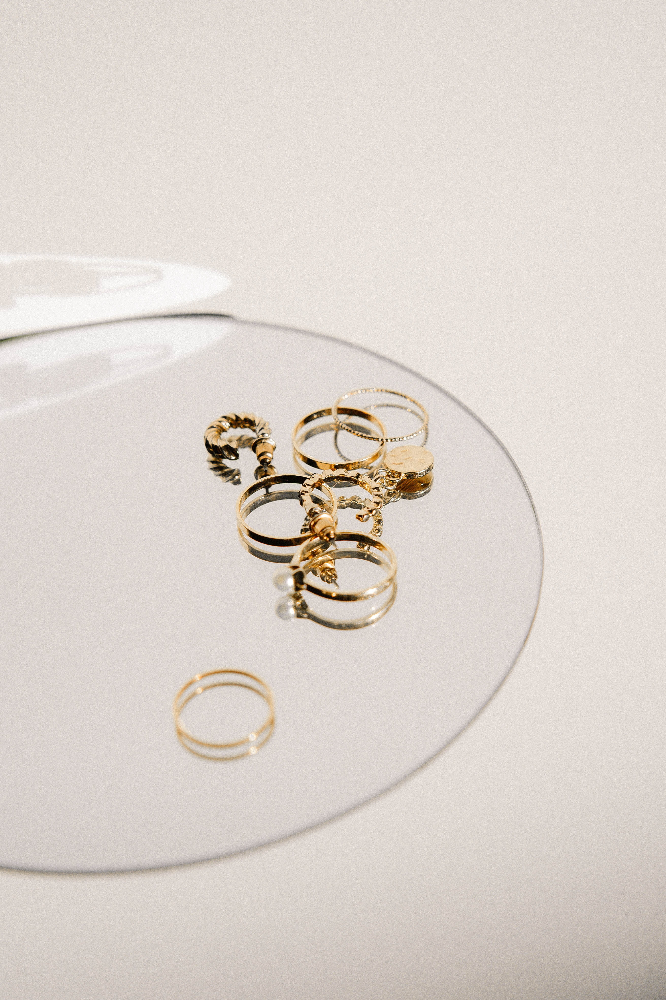

Last week we looked at luxurious jewellery brands, this week we look at the opposite side. Jewellery is incredibly important in our everyday attire, it can make or break an evening dress, it could make you stand out in a good way or in a bad way. However, the majority of people around the world cannot afford to buy five-thousand-pound bracelets or one hundred-thousand-pound watches. There are many luxurious jewellery brands but there are more affordable brands on the market for everyone.

 

Despite Tiffany and Co. having very expensive items on sale, they also do bracelets at an affordable price of under one hundred pounds. Pandora are one of the most popular jewellery brands out there as they provide affordable bracelets, necklaces and rings ranging from fifty pounds to just over one hundred.

 

However, these brands are the middle ground. They are not expensive, and they provide delicately crafted jewellery, but they try to present themselves as a luxury brand through the typography on their logos and it is working out for them.

 

In order to find the difference in typography between luxury and affordable brands in jewellery, we need to have a look at the uprising jewellery brands and at the ones who sell other items as well.

 

ASOS is a cheap, affordable company that produces clothing, accessories, jewellery and many other items to people aged between fourteen to twenty-five on average. As students are mostly counting the price of anything they buy, ASOS delivers low quality but affordable items of jewellery. It is recommended that only men buy jewellery from there as they have swarmed that market with cheap rings as it becomes more and more popular for men to wear them.  Other companies on the lower scale of luxurious jewellery include Next who also sell clothes, Tk Maxx who seemingly sell everything possible and John Lewis.

 

Despite these items not being very expensive there are some which complement the evening dress just as much as a cartier necklace would. The major difference is that these brands don’t focus solely on jewellery and therefore there is a huge difference in typography of the logos as well with these brands preferring minimalism but for that minimalism to cover the surface of the background from top to bottom.

 

Upcoming jewellery brands are one thing to look out for in today’s market as majority of the items are hand crafted and sold at a cheap price. One of these companies is Bijoux de Mimi who have sprung into the jewellery market with a very young owner who understands students at university. She started the company at home during lockdown and never thought that it would turn into a six-figure business in the space of just over a year. They produce beautiful jewellery at very affordable prices and their logo is simplistic and lures in a wide variety of customers.

 

Next week we will look at a different aspect of luxury life. Where we eat our most delicious meals. The most Luxurious restaurants around the world and their logos!