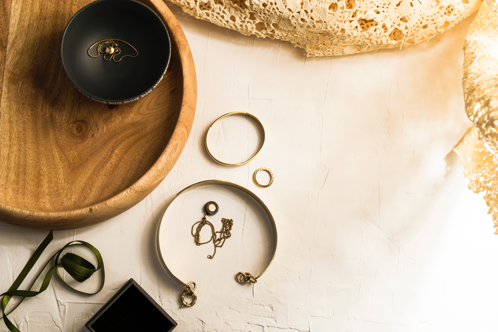
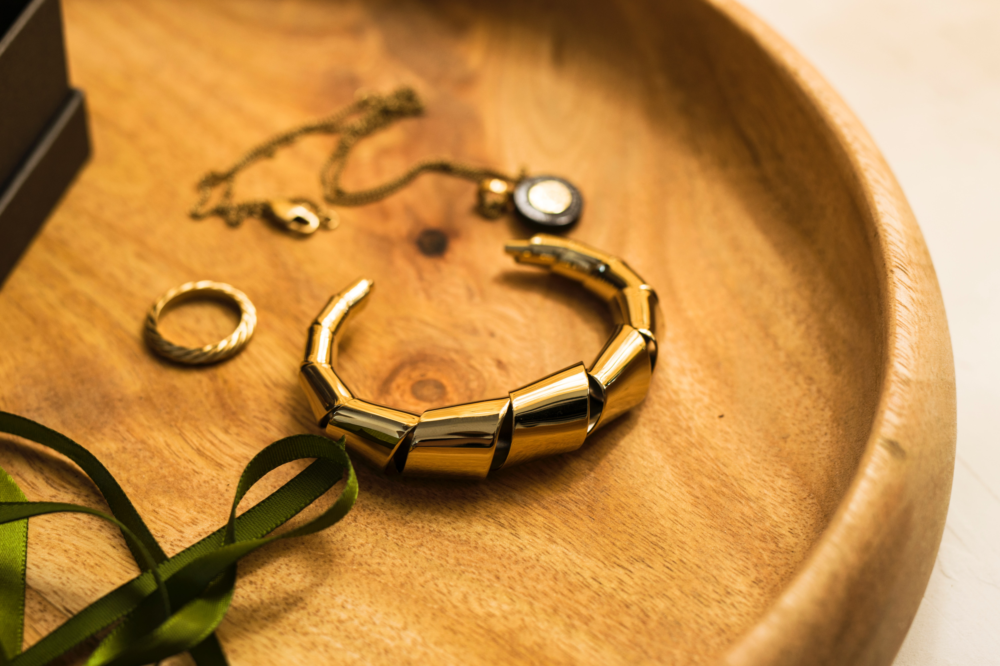

In the first two weeks we spoke about clothing brands. This week and next week we will be speaking about Luxurious jewellery brands, affordable jewellery brands and how the typography in their logos differ to welcome in their customers.

 

In both articles over the two weeks, we will also include watches as they play a massive role in both male and female accessories.

 

Cartier is one of the most well-known Luxury Jewellery brands in the world. Their prices differ from 300 pounds for a bracelet all the way past hundreds of thousands for a watch.  One of their best sellers is a unisex cartier bracelet retailing at just under five thousand pounds.

 

For the company to attract buyers they have a great social team and most notably many celebrities prefer their brand for their evening accessories. However, the branding of the company plays a massive role and in that branding we of course have the typography of the logo.

 

The delicate golden swirls of Cartier are presented most on a white background and the name itself tends to not take up much space just like on their accessories. Similar to the clothing brands, the large background and small typography give the customers a feel of Luxury as space usually equals money and for something to have a space that large but only use up so little of it screams luxury.

 

The golden colour adds to the luxury aspect however, the serifs and the font make the brand feel just that little bit more luxurious than the others.

 

Cartier is not the sole luxury jewellery brand that opts for this aesthetics. In fact, just as the luxury clothing brands typography is similar so is the case for the jewellery brands. Patek Phillipe is one of the most famous luxury watch brands in the world and of course is one of the most expensive with majority of watches costing upwards of one hundred thousand pounds which would buy you a nice car at the very minimum. Other brands include Tiffany and Co. who produce incredibly delicate items of jewellery and this in turn is reflected on their logo.

 

Come back next week to read about the affordable jewellery brands and how they attract their customers using typography in their logos.