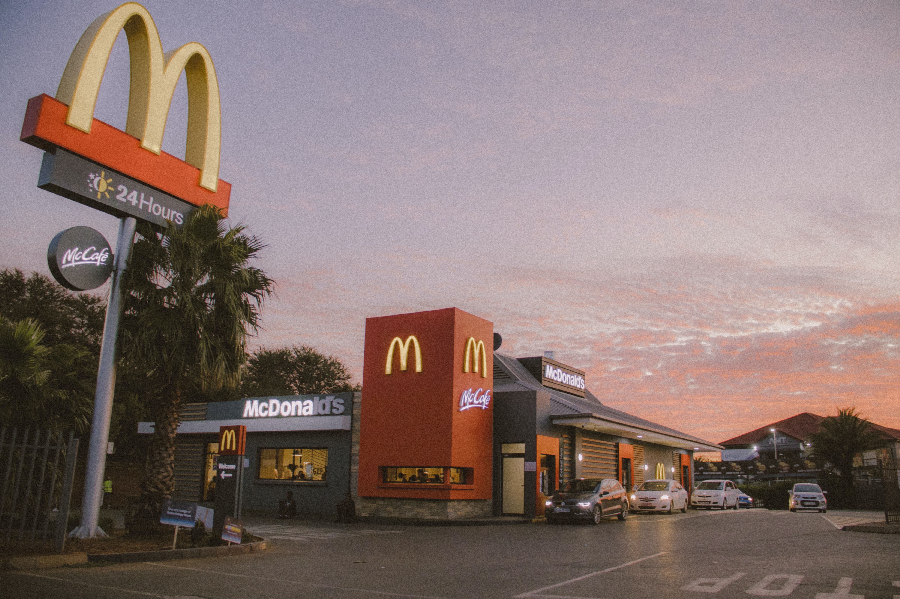
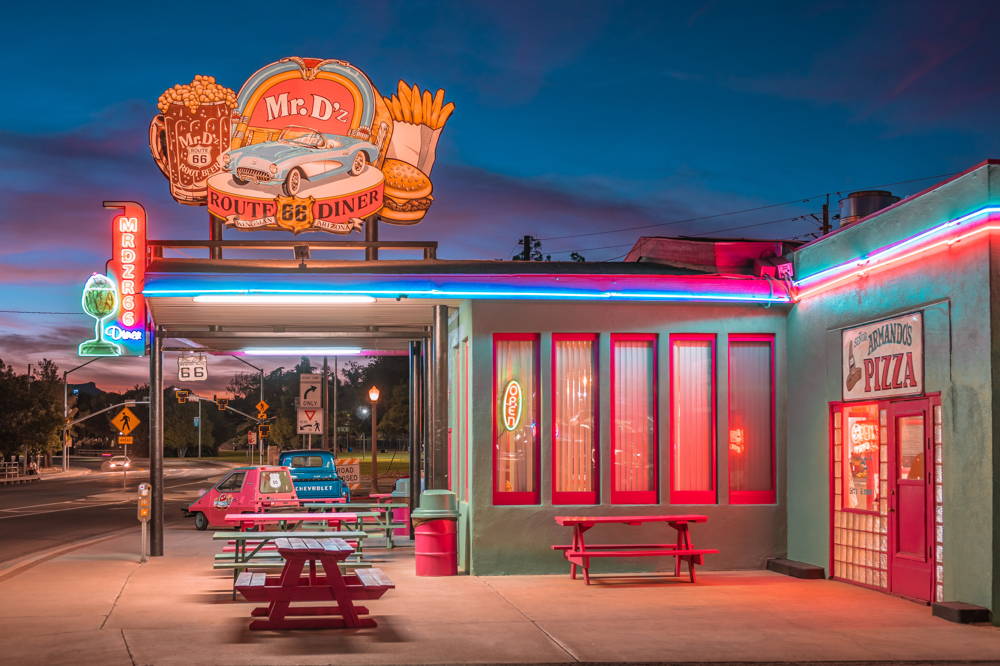

Despite affordable restaurants not having a media present chef, it is still a business, and the same key principals apply just as they do with the Luxury restaurants. There are of course a lot of different varieties of affordable restaurants with big chains such as McDonalds, KFC and a lot of other fast-food chains and there are also small family run restaurants across the globe. 

Because the small family restaurants don’t have a huge amount of funding, in most cases, so they must make do with what they have. Luckily, Typography isn’t too expensive and a good logo design along with a carefully crafted menu and a family feel in the restaurant can completely change the dynamic.

The Restaurant business is one of the most heavily congested markets in the world and in order to attract clients not only does the food need to look good but so does the restaurant itself. Some small, affordable restaurants also look to capitalise on social media. Platforms such as Tik Tok or Instagram can help these small businesses grow but even if they get popularity on these platforms the most important aspect in order to keep their business open is still the food. There isn’t one key aspect that makes the restaurant business work it’s all of them combining.

The most well-known affordable restaurants all have an iconic logo. Of course, at the top of that list is McDonalds. As of 2018 it is the largest restaurant chain by revenue, they serve over 69 million customers daily in over 100 countries and they have over 38 thousand restaurants. Of course, not every restaurant chain can grow to this size but arguably one of the most important aspects of McDonalds is their iconic logo. The yellow M in the logo represents the golden arches that were the substance of the newly constructed architecture of the first franchised restaurant in 1952 and the font used is the Lovin’ Sans. This font is used in all their typography. Therefore, it is clear to see that for the biggest companies, typography is one of the most important aspects.

It is clear to see that there is not a huge difference in the use of Typography between Luxurious and Affordable businesses in the clothing, jewellery and restaurant industry. This is simply due to us, the customers and what appeals to most of us. Despite every single one of us being completely different to one another, our interpretation of images, logos and typography doesn’t differ all that much and there is more in common between us than we dare to imagine.